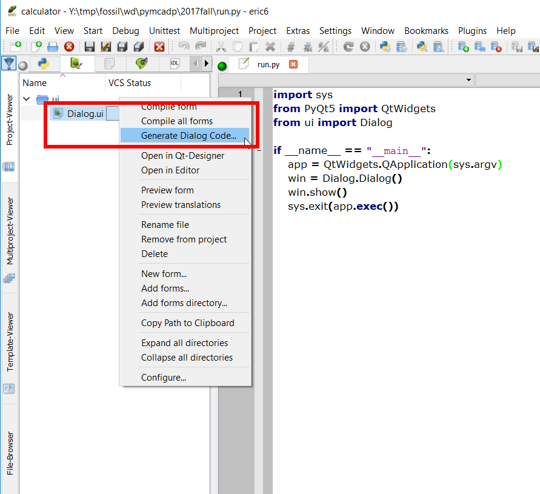
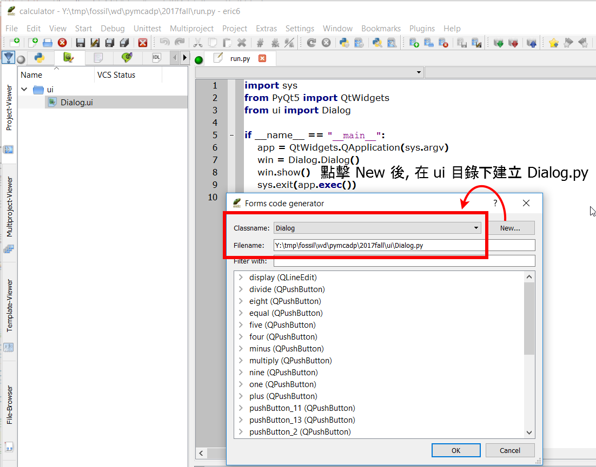

Title: CP PyQt5 視窗程式 (二)
Date: 2017-11-12 11:00
Category: Course
Tags: 2017fall, PyQt5
Slug: kmol-2017-fall-pyqt5-2
Author: yen

當使用者透過 Eric6 與 Qt Designer 完成基本計算機表單的視窗對話框後, 分別使用了 Qt Designer 中的 Grid Layout、Press Button 與 Line Edit 等 Widgets.

<!-- PELICAN_END_SUMMARY -->

<iframe src="https://player.vimeo.com/video/242529543" width="640" height="491" frameborder="0" webkitallowfullscreen mozallowfullscreen allowfullscreen></iframe>

<a href="https://vimeo.com/242529543">國立虎尾科技大學機械設計工程系計算機程式 - 一乙第十週第二部分, 說明如何利用 Eric6 建立簡單的計算機程式, 包含利用  Qt Designer 建立對話框, 並建立透過主程式引用執行.</a> from <a href="https://vimeo.com/user24079973">國立虎尾科技大學機械設計工程系</a> on <a href="https://vimeo.com">Vimeo</a>.

接下來則必須配合 Dialog.ui, 在 Eric6 的表單頁面, 在 Dialog.ui 位置以滑鼠右鍵, 指定 Generate Dialog Code, 操作畫面如下:

</img>

接著點擊 New 後在 ui 目錄下, 建立 Dialog.py 檔案, 操作畫面如下:

</img>

之後與 Dialog.ui 編譯後的 Ui_Dialog.py 程式碼對應的 Dialog.py (可以自選 Generate Dialog Code 的檔案名稱 ,這裡選擇存為 Dialog.py), 將存放與對話表單相應的程式邏輯.

意即, 當用戶使用 Qt Designer 設計對話視窗表單後, 整體程式開發流程將分為 1) 以滑鼠產生對話框圖形介面與 2) 配合手動建立邏輯檔案等兩個流程, 由 Qt Designer 自動轉為 Ui_Dialog.py 程式碼的基本圖形介面建立流程, 使用者將不會手動編輯改變此一檔案的內容, 且主程式的模組導入則以手動建立的邏輯程式檔案為主.

例如: 上述位於 ui 目錄中的 Dialog.ui 編譯後, 得到 Ui_Dialog.py, 而與 Dialog.ui 對應的 Generate Dialog Code 所產生的 Dialog.py 檔案, 與主程式檔案 run.py 如下列所示:

run.py

<pre class="brush: python">
# 導入 sys 模組, 主要用於 sys.argv 成員變數
import sys
# 從 PQt5 模組導入 QtWidgets 模組類別
from PyQt5 import QtWidgets
# 從 ui 目錄導入 Dialog.py, Python 程式檔案本身就是一個模組, 且文件名就是模組名
from ui import Dialog

# 每一個 Python 程式都可以直接被執行, 或者被導入其他程式中, 當成導入模組執行
# 假如程式檔案直接被執行時, 全域變數 __name__ 就會等於 "__main__" 字串
# 因此, 以下的判斷式的意思是, 若本檔案直接被執行時, 就會執行以下內縮程式區段
if __name__ == "__main__":
    # 利用 QtWidgets.QApplication 類別建立案例物件, 且以 sys.argv 作為輸入
    app = QtWidgets.QApplication(sys.argv)
    # 利用所導入的 Dialog 模組中的 Dialog 類別建立物件案例, 對應的變數名稱設為 win
    win = Dialog.Dialog()
    # 執行 win 物件中的 show() 方法, 因為所有 Qt5 部件內定為不顯示
    win.show()
    # 執行 app 物件的 exec() 方法, 表示進入視窗事件重複迴圈, 等待使用者滑鼠輸入
    # 將 app.exec() 當作 sys.exit() 執行輸入, 表示使用者可以透過視窗的 x 按鈕結束執行
    sys.exit(app.exec())
</pre>

Dialog.py 如下所示:

<pre class="brush: python">
# -*- coding: utf-8 -*-

"""
Module implementing Dialog.
"""

from PyQt5.QtCore import pyqtSlot
from PyQt5.QtWidgets import QDialog

from .Ui_Dialog import Ui_Dialog

# Dialog 類別同時繼承 QDialog 與 Ui_Dialog 類別
class Dialog(QDialog, Ui_Dialog):
    """
    Class documentation goes here. (若有類別相關說明文件內容, 放在此處)
    """
    def __init__(self, parent=None):
        """
        Constructor (類別建構子)
        
        @param parent reference to the parent widget
        @type QWidget
        """
        # 利用 super 類別調用 parent 類別中的建構子
        super(Dialog, self).__init__(parent)
        # 上一行在 Python3 可以寫為 super().__init__()
        # 利用 Ui_Dialog 類別中的 setupUi 方法, 以 self 視窗部件建立使用者介面
        self.setupUi(self)
        # 當多個 signal 同時指向同一個 slot 處理時, 採用 for loop
        num_button = [self.one,  self.two,  \
        self.three,  self.four,  self.five,  self.six,  self.seven,  self.eight,  self.nine,  self.zero]
        plus_minus = [self.plus,  self.minus]
        multiply_divide = [self.multiply,  self.divide]
        #self.one.clicked.connect(self.number)
        # 數字按鍵的 signal 與 slot 設定
        for i in num_button:
            i.clicked.connect(self.number)
        
        # 加減鍵的 signal 與 slogt 設定
        for i in plus_minus:
            i.clicked.connect(self.additiveOperatorClicked)
        
        # 等於按鍵的 signal 與 slot 設定
        self.equal.clicked.connect(self.equalClicked)
        
        # 乘與除按建的 signal 與 slot 設定
        for i in multiply_divide:
            i.clicked.connect(self.multiplicativeOperatorClicked)
        
        # 等待運算的加或減
        self.pendingAdditiveOperator = ''
        self.sumSoFar = 0.0
        # 起始時, 等待使用者輸入運算數值變數為真
        self.waitingForOperand = True
        
        # 加入可以處理先乘除後加減的運算時, 新增暫存在記憶體的總數, sumInMemory
        # 以及暫存尚未完成運算的運算子 factorSoFar
        self.sumInMemory = 0.0
        self.factorSoFar = 0.0
        # 等待運算的乘或除
        self.pendingMultiplicativeOperator = ''
        
    def number(self):
        clickedButton = self.sender()
        digitValue = int(clickedButton.text())
        # when user clicks 0.0
        if self.display.text() == '0' and digitValue == 0.0:
            return
        
        # if under digit input process, clear display for the very first beginning
        # waitingForOperand 為 True 已經點按運算數值按鈕
        if self.waitingForOperand:
            # 清除 display 
            self.display.clear()
            # 將判斷是否已經點按運算數值按鈕的判斷變數重新設為  False
            self.waitingForOperand = False
        # 利用 setText() 設定 LineEdit 元件顯示字串, 利用 text() 取出目前所顯示的字串, 同時也可利用 text() 擷取按鈕物件上顯示的字串
        #self.display.setText(self.display.text() + self.sender().text())
        self.display.setText(self.display.text() + str(digitValue))
        
    def additiveOperatorClicked(self):
        # 確定按下加或減
        clickedButton = self.sender()
        # 確定運算子, 為加或減
        clickedOperator = clickedButton.text()
        # 點按運算子之前在 display 上的數字, 為運算數
        operand = float(self.display.text())
        
        # 納入乘與除之後的先乘除後加減運算邏輯
        if self.pendingMultiplicativeOperator:
            if not self.calculate(operand, self.pendingMultiplicativeOperator):
                self.abortOperation()
                return

            self.display.setText(str(self.factorSoFar))
            operand = self.factorSoFar
            self.factorSoFar = 0.0
            self.pendingMultiplicativeOperator = ''
            
            
        # 假如有等待運算的加或減, 進入執行運算
        # 若前面已經有運算數等待運算, 則執行計算
        if self.pendingAdditiveOperator:
            if not self.calculate(operand, self.pendingAdditiveOperator):
                self.abortOperation()
                return
            # 顯示目前的運算結果
            self.display.setText(str(self.sumSoFar))
        else:
            # 假如仍未進入等待運算的階段, 則將運算數與 self.fumSoFar 對應
            self.sumSoFar = operand

        self.pendingAdditiveOperator = clickedOperator
        # 進入等待另外一個運算數值的階段, 設為 True 才會清空 LineEdit
        self.waitingForOperand = True

    def multiplicativeOperatorClicked(self):
        clickedButton = self.sender()
        clickedOperator = clickedButton.text()
        operand = float(self.display.text())

        if self.pendingMultiplicativeOperator:
            if not self.calculate(operand, self.pendingMultiplicativeOperator):
                self.abortOperation()
                return

            self.display.setText(str(self.factorSoFar))
        else:
            self.factorSoFar = operand

        self.pendingMultiplicativeOperator = clickedOperator
        self.waitingForOperand = True
    
    def equalClicked(self):
        # 從 display 取的運算數值
        operand = float(self.display.text())
        
        # 先乘除的運算處理
        if self.pendingMultiplicativeOperator:
            if not self.calculate(operand, self.pendingMultiplicativeOperator):
                self.abortOperation()
                return
            # factorSoFar 為乘或除運算所得之暫存數值
            operand = self.factorSoFar
            self.factorSoFar = 0.0
            self.pendingMultiplicativeOperator = ''
        
        # 若有等待加或減的運算子, 執行運算
        if self.pendingAdditiveOperator:
            if not self.calculate(operand, self.pendingAdditiveOperator):
                self.abortOperation()
                return

            self.pendingAdditiveOperator = ''
        else:
            self.sumSoFar = operand

        self.display.setText(str(self.sumSoFar))
        self.sumSoFar = 0.0
        self.waitingForOperand = True

    # 右運算數與等待運算子當作輸入
    def calculate(self, rightOperand, pendingOperator):
        # 進入計算流程時, 用目前輸入的運算數值與 self.sumSoFar 執行計算
        if pendingOperator == "+":
            self.sumSoFar += rightOperand
        elif pendingOperator == "-":
            self.sumSoFar -= rightOperand

        elif pendingOperator == "*":
            self.factorSoFar *= rightOperand
        elif pendingOperator == "/":
            if rightOperand == 0.0:
                return False

            self.factorSoFar /= rightOperand

        return True
</pre>

各變數的說明:

sumInMemory contains the value stored in the calculator's memory (using MS, M+, or MC).

sumSoFar stores the value accumulated so far. When the user clicks =, sumSoFar is recomputed and shown on the display. Clear All resets sumSoFar to zero.

factorSoFar stores a temporary value when doing multiplications and divisions.

pendingAdditiveOperator stores the last additive operator clicked by the user.

pendingMultiplicativeOperator stores the last multiplicative operator clicked by the user.

waitingForOperand is true when the calculator is expecting the user to start typing an operand.

<a href="http://doc.qt.io/qt-5/qapplication.html">QApplication</a>

<a href="http://doc.qt.io/qt-5/qtwidgets-module.html">QtWidgets</a>

<a href="http://doc.qt.io/qt-5/qdialog.html">QDialog</a>

<a href="https://pythonspot.com/en/pyqt5-signals-and-slots/">PyQt5 Signal and Slots</a>

<a href="http://doc.qt.io/qt-5/qtwidgets-widgets-calculator-example.html">Qt5 計算機範例說明</a>

### 當按下數字按鍵

Pressing one of the calculator's digit buttons will emit the button's clicked() signal, which will trigger the number() slot.

### sender 在 Qt5 中為指標

First, we find out which button sent the signal using QObject::sender(). This function returns the sender as a QObject pointer. Since we know that the sender is a Button object, we can safely cast the QObject. We could have used a C-style cast or a C++ static_cast<>(), but as a defensive programming technique we use a qobject_cast(). The advantage is that if the object has the wrong type, a null pointer is returned. Crashes due to null pointers are much easier to diagnose than crashes due to unsafe casts. Once we have the button, we extract the operator using QToolButton::text().

### 考慮使用者按下 0 鍵

The slot needs to consider two situations in particular. If display contains "0" and the user clicks the 0 button, it would be silly to show "00". And if the calculator is in a state where it is waiting for a new operand, the new digit is the first digit of that new operand; in that case, any result of a previous calculation must be cleared first.