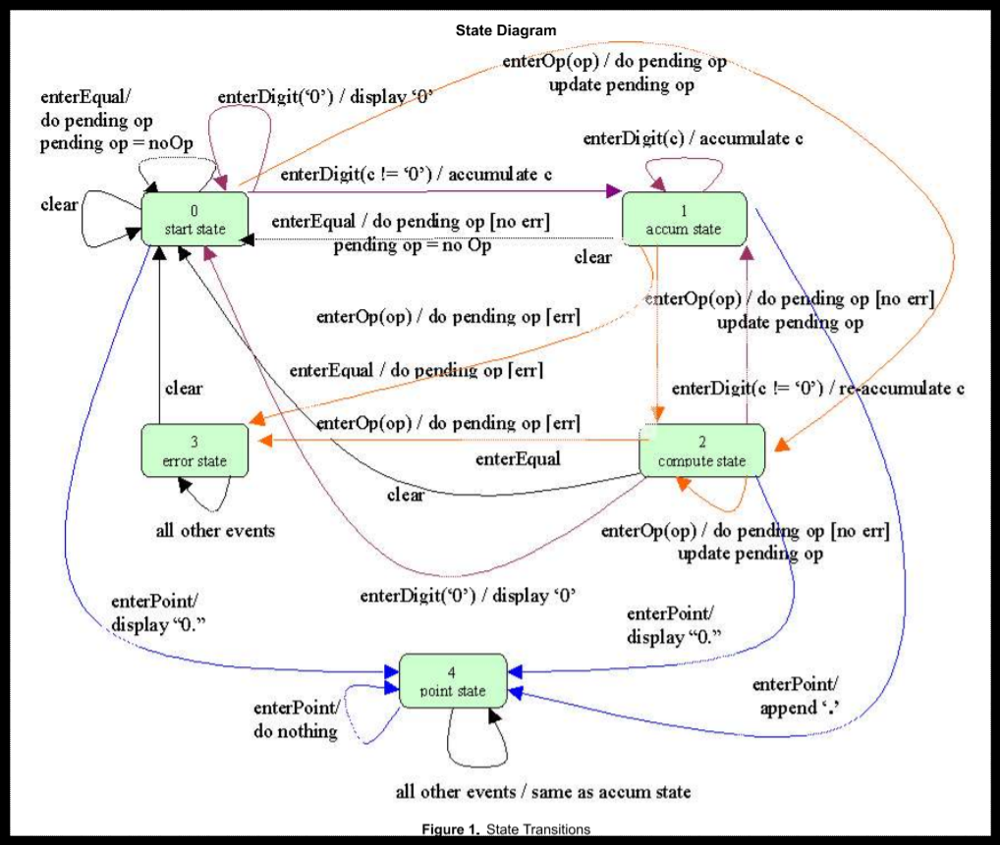

目前正在進行中的普通計算機程式設計, 採用 PyQt5 與 Python3 建立, 預計採用事件導向的方式完成.

<!-- PELICAN_END_SUMMARY -->

計算機視窗介面
---

PyQt5 普通計算機視窗介面:

  *  10 個數字鍵, 分別為 0, 1, 2, 3, 4, 5, 6, 7, 8, 9, 使用者按下個數字鍵, 將會在顯示幕中顯示該數字值
  *  小數點按鍵 ., 按下後顯示小數點
  *  加號按鍵 +, 按下後進行兩數相加
  *  減號按鍵 -, 按下後進行兩數相減
  *  乘號按鍵 *, 按下後進行兩數相乘
  *  除號按鍵 /, 按下後進行兩數相除
  *  等於按鍵 =, 將運算結果列在顯示幕
  *  清除顯示幕按鍵 C, 清除顯示幕內容並重置暫存資料

首先, 重複按數字鍵, 數字會進位, 例如: 按下兩次 1, 表示輸入 11
但是, 若目前顯示幕為 0, 則再按 0 並不會進位成為 00, 而仍然顯示 0, 而且若初始顯示幕為 0, 使用者按下運算數時, 顯示幕應該會清除, 然後配合使用者輸入的數字顯示.

因此按數字鍵的處理方法, 必須判斷:

  *  是否在等待輸入運算數階段, 若是則必須刷新顯示幕, 而且改變判斷狀態, 因為在初始時, 等待輸入運算數判斷變數為真,  一旦已經輸入數值, 則該變數必須重置
  *  顯示幕是否為 0 或 0.0, 這時若再輸入 0 則數值並不會累計, 而是維持原先顯示的 0 狀態

表示計算機經歷狀態改變, 而且在不同狀態下會有不同表現.

按下 C 清除螢幕, 重置各暫存值, 這時顯示幕為 0, 按一下 5, 則顯示幕中的 0 由 5 取代, 若再按一個 5, 則應該顯示 55, 表示可以字串堆疊的方式, 將原先顯示幕中的 5 字串, 再附加字串 5, 即可成為 55.

接著若按下 +, 則顯示幕上仍顯示 55, 若在 + 號之後, 再按下 3, 則顯示幕已經不能再以附加字串的方式處理, 變成 553, 而應該只顯示 3, 而且若接下來按下 =, 之前的 55 應該要在顯示 3 之前暫存, 以便能夠在按下 = 時, 完成 55 + 3 的運算, 並且將答案 58 列在顯示幕上.

因此, 若單純的兩數相加, 狀態分為"等待輸入運算", "運算子", 顯示幕中的數值以及目前的暫存值, 以 55 + 3 = 58, 總共經歷:

  *  一開始顯示幕為 0, "等待輸入運算數" 變數為 True, 累加暫存變數值為 0.
  *  使用者輸入第一個 5, 進入數字按鍵處理方法, 因"等待輸入運算數"為真, 因此刷新顯示幕, 重置"等待輸入運算數", 在顯示幕中列出 5.
  *  使用者輸入第二個 5, 再次進入數字按鍵處理方法, 因"等待輸入運算數"為假 (因為正處於運算數輸入階段), 因此不會刷新顯示幕, 而是將第二次輸入的 5 與顯示幕上的 5 堆疊, 顯示 55.
  *  使用者輸入 +, 這時顯示幕畫面仍顯示 55, 但是"運算子"變數存入 "+" 字串, 顯示幕中的 55 數值暫時放入累加變數, 成為左運算數, 運算子為  +, 離開之前, 將"等待輸入運算數"設為真.
  * 使用者再輸入數字 3, 進入數字按鍵處理方法, 因"等待輸入運算數"為真, 因此刷新顯示幕, 重置"等待輸入運算數", 在顯示幕中列出 3.
  * 使用者此時輸入 =, 左運算數即為暫存累加變數, 為 55, 運算子為  +, 顯示幕上的 3 則為目前的右運算數, = 按鍵處理方法, 進入暫存累加變數 55 再加上運算數 3 的運算, 得到 58, 將數值列在顯示幕, 所有變數重置恢復原始值, 即"等待輸入運算數"為真, 暫存變數歸零.

上述計算機的行為, 可以利用有限狀態機器的方式進行模擬, 普通計算機有多少狀態? 當計算機從某一狀態轉進另一狀態時, 應該如何表示出計算機該有的行為?

Github 協同展示倉儲: <https://github.com/scrum-1/scrum_pyqt5_calculator>

參考資料
---

[Calculator Walkthrough: Part 4](https://fsharpforfunandprofit.com/posts/calculator-complete-v2/)

[Finite State Machines and the State Design Pattern](https://cnx.org/contents/m6wVXVCe@2/Finite-State-Machines-and-the-)

